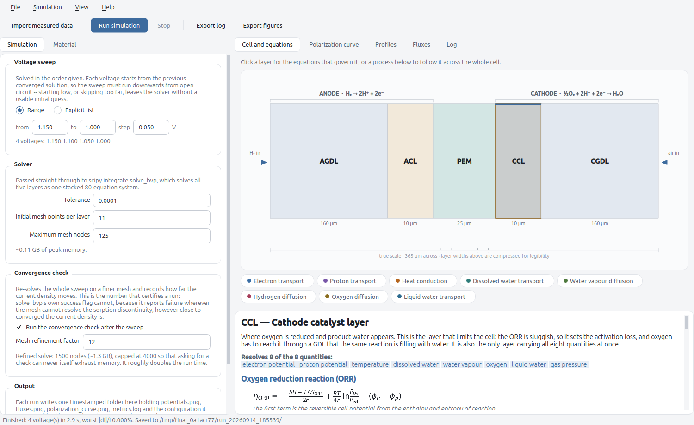

# 1D PEM Fuel Cell Model — Graphical Interface

A PySide6 desktop front end for [1D-PEMFC-Model][model], a one-dimensional,
steady-state, non-isothermal, two-phase, macro-homogeneous membrane electrode
assembly model for polymer electrolyte membrane fuel cells.



It is a view onto `pemfc_1d` and nothing more: it calls `solve` with the
arguments the panels describe, collects the same metrics, and writes the same
timestamped run directory, so a run started from the window and one started
from the command line with the same settings produce the same numbers. The
solver is a separate project and is not aware the window exists.

## Installation

The model is pulled in automatically, pinned to a released tag:

```bash
poetry install
```

Then:

```bash
pemfc-1d-gui
```

or equivalently `python -m pemfc_1d_gui`.

### Working on both projects at once

`pyproject.toml` pins the model to a git tag so that a given revision of this
interface always runs against the solver it was tested with. To point it at a
local checkout instead, override the source without committing the change:

```bash
poetry add --editable ../1D-PEMFC-Model
```

Drop the override before committing, and raise the pinned tag deliberately —
running the tests when you do.

## The window

**The cell.** The MEA cross-section is drawn from `Params.L` rather than loaded
from an image, so it is a picture of the cell actually configured and redraws
when a thickness is edited. Layer widths are compressed — drawn true to size
the catalyst layers would be a sixteenth the width of the diffusion layers and
impossible to see — so each layer prints its real thickness and the ruler
underneath is at true scale.

Clicking a layer shows the equations that govern it: the constitutive law and
the balance for each quantity the layer resolves, transcribed from the
corresponding function in the model's `model.py`, with the reaction kinetics
and the simplifications currently active in that layer written out alongside.
The eight chips below the cell follow one transport process across the whole
assembly, layer by layer.

**Configuration.** The *Material* tab exposes every constructor argument of
`Params`, grouped as the model's `params.py` groups them and labelled with its
units; the five layer thicknesses are edited in microns. The *Simulation* tab
holds the voltage sweep, the tolerance, the mesh settings and the convergence
check, with the memory cost of a mesh ceiling shown as it is changed. Both open
at the values the model ships with, and a field that has been changed from its
default is tinted.

**Results.** The polarization curve, the profiles and the fluxes appear in the
window with the standard matplotlib toolbar, and the *Log* tab shows the run's
progress above the finished `metrics.log`. *View > Appearance* switches between
a light and a dark palette; the figures keep their white ground in both, so
what is on screen and what is written to the run directory stay the same
picture.

**Import and export.** *File > Import configuration* reads a settings file back
into the panels, and *Export configuration* writes one; every run directory also
gets a `config.json` recording what it was run with, since the material
parameters have no command-line equivalent. *Export log* saves a copy of
`metrics.log` anywhere, and *Export figures* copies the three PNGs.

*Import measured data* reads a two-column file of current density [A/cm²] and
cell voltage [V] — comma, semicolon, tab or space separated, header optional —
and draws it over the polarization curve. This is a visual comparison only: no
agreement metric is computed, for the reason given under *Not measured here* in
the run log. When validation is added it belongs in `pemfc_1d.metrics` beside
the convergence metrics, not in the interface.

One limitation is worth stating: `solve_bvp` is a single opaque call per sweep,
so the window cannot report per-voltage progress and cannot interrupt a solve
part way. *Stop* takes effect by skipping the convergence check.

## Run directories

A run writes `results/run_YYYYmmdd_HHMMSS/` holding the three figures, a
`metrics.log` and a `config.json`. The log records the model's released version
and this interface's git revision — the model is installed rather than checked
out, so it cannot report a revision of its own, and the program that actually
ran is this one.

## Layout

```
pemfc_1d_gui/
├── theme.py            # the design system: palettes and stylesheet
├── equations.py        # the per-layer equation and transport documentation
├── equationview.py     # renders one layer's equations
├── mathrender.py       # maths typesetting for the equation panel
├── diagram.py          # the MEA cross-section, drawn from Params.L
├── transportbar.py     # the transport-process chips under the cell
├── paramfields.py      # editors for every Params field
├── config.py           # the run configuration and its JSON form
├── panels.py           # the Material and Simulation tabs
├── runner.py           # the sweep, run off the GUI thread
├── plots.py            # the embedded figures
├── dataio.py           # measured-data import
├── about.py            # authorship, sources and contact details
└── app.py              # the main window
tests/
└── test_gui.py         # the boundary between the window and the model
docs/images/            # the screenshot shown in this README
```

## Tests

```bash
poetry run pytest tests/
```

They run headless through Qt's offscreen platform. The point of them is the
boundary between the interface and the model: the window must not be able to
perturb a parameter on its way to `solve`. The heaviest check drives a full
pass through the editors and compares every field of `Params` against a freshly
constructed default.

The model's own numerical correctness is not tested here — it is tested in
[its own repository][model], against a golden file.

## What this depends on

Only the names `pemfc_1d` exports, which are listed in that package's docstring
and pinned by its `tests/test_public_api.py`. Nothing in the model imports this
interface, so the solver keeps working with the interface absent, and a bug
here cannot change a number the model produces.

## License and attribution

BSD-3-Clause, inherited from the reference implementation the model's physics
follows. See [LICENSE](LICENSE).

The physics is credited in the model's repository; the interface adds no
physics of its own. The reference is:

> R. Vetter and J. O. Schumacher, *Free open reference implementation of a
> two-phase PEM fuel cell model*, Computer Physics Communications **234**
> (2019) 223–234. <https://doi.org/10.1016/j.cpc.2018.07.023>

## Credits

Written by Victor Constantin Cartsounis (CEFET-MG) as the codebase for a
master's thesis, supervised by Sidney Nicodemos da Silva.

[model]: https://github.com/victorcartsounis/1D-PEMFC-Model
